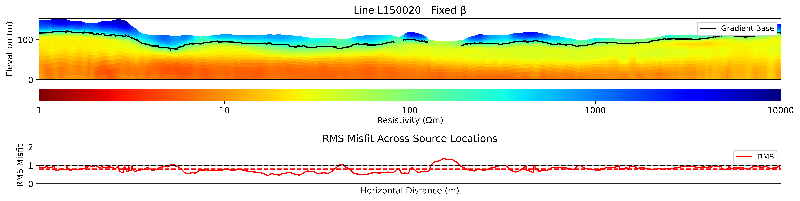

# Airborne EM Inversion for Permafrost Mapping (NWT, Canada)

This repository contains code to perform frequency-domain airborne electromagnetic (AEM) inversion and depth of investigation (DOI) analysis for permafrost mapping in the Northwest Territories (NWT), Canada, using the open-source framework [SimPEG](https://simpeg.xyz/).

The code is part of the study:
> Moshtaghian et al., 2025. *Airborne electromagnetic imaging of permafrost reveals heterogeneity and drivers of permafrost change in the discontinuous permafrost zone of northwestern Canada*.

---

## Project Structure

```
├── data/                   # Input AEM data files (1D sounding per line)
├── outputs/                # Output folder for inverted models and figures
├── src/                    # Source code modules
│   ├── depth_of_investigation.py
│   ├── gradient.py
│   ├── inversion.py
│   ├── mesh.py
│   ├── plotting.py
│   ├── survey.py
├── main.py                 # Entry point to configure and run inversion
├── run_aem_inversion.py    # Main inversion workflow logic
├── environment.yml         # Conda environment with dependencies
└── README.md               # Project documentation
```

---

## Quickstart

### 1. Clone the Repository

```bash
git clone https://github.com/simpeg-research/Moshtaghian-et-al-2025-aem-nwt.git
cd Moshtaghian-et-al-2025-aem-nwt
```

### 2. Create Environment

```bash
conda env create -f environment.yml
conda activate simpeg-aem-nwt
```

### 3. Run Inversion

Edit `main.py` to select a line (e.g., L120030) and run:

```bash
python main.py
```

You can control whether to re-run inversion, save results, or plot only by modifying `main.py`.

---

## Dependencies

Core libraries used:
- [SimPEG](https://docs.simpeg.xyz/)
- [discretize](https://discretize.simpeg.xyz/)
- [numpy](https://numpy.org/)
- [pandas](https://pandas.pydata.org/)
- [matplotlib](https://matplotlib.org/)
- [contextily](https://contextily.readthedocs.io/en/latest/) (optional, for map tiles)

All dependencies are listed in `environment.yml`.

---

## Outputs

- Inverted resistivity sections  
- RMS misfit profiles  
- Depth of investigation (DOI) overlays and gradient-based permafrost base estimates  
- All results saved in `outputs/` as `.pkl` and `.png`

Below is an example output from the fixed β inversion of AEM Line L150020, showing the resistivity model with a gradient-based estimate of the permafrost base (black contour) and the corresponding RMS misfit profile.

<p align="center">
  
</p>

<p align="center"><b>Figure:</b> Fixed β inversion results for Line L150020. Top: inverted resistivity model with permafrost base estimated using a second-order gradient method (black line). Bottom: RMS misfit across source locations.</p>

---

## License

MIT License. See `LICENSE` file.

---

## Acknowledgments

This work was conducted as part of a larger collaboration involving researchers at the University of Alberta, the University of British Columbia, and the SimPEG community. Data were collected in the Northwest Territories with support from federal and territorial partners. For scientific context, please cite:

> Moshtaghian et al., *Airborne electromagnetic imaging of permafrost reveals heterogeneity and drivers of permafrost change in the discontinuous permafrost zone of northwestern Canada*, 2025 (In Prep).
